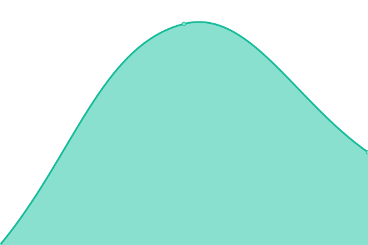

# [📈 Live Status](https://nbaglietto.github.io/upptime): <!--live status--> **🟧 Partial outage**

This repository contains the open-source uptime monitor and status page for [Nahuel Baglietto](www.baglietto.ar), powered by [Upptime](https://github.com/upptime/upptime).

With [Upptime](https://upptime.js.org), you can get your own unlimited and free uptime monitor and status page, powered entirely by a GitHub repository. We use [Issues](https://github.com/nbaglietto/upptime/issues) as incident reports, [Actions](https://github.com/nbaglietto/upptime/actions) as uptime monitors, and [Pages](https://nbaglietto.github.io/upptime) for the status page.

<!--start: status pages-->
<!-- This summary is generated by Upptime (https://github.com/upptime/upptime) -->
<!-- Do not edit this manually, your changes will be overwritten -->
<!-- prettier-ignore -->
| URL | Status | History | Response Time | Uptime |
| --- | ------ | ------- | ------------- | ------ |
|  [baglietto.ar](https://www.baglietto.ar) | 🟩 Up | [baglietto-ar.yml](https://github.com/nbaglietto/upptime/commits/HEAD/history/baglietto-ar.yml) | 

 1322ms
     
 | 

<a href="https://nbaglietto.github.io/upptime/history/baglietto-ar">100.00%</a>
    

|  [Blog](https://blog.baglietto.ar) | 🟩 Up | [blog.yml](https://github.com/nbaglietto/upptime/commits/HEAD/history/blog.yml) | 

 9025ms
     
 | 

<a href="https://nbaglietto.github.io/upptime/history/blog">100.00%</a>
    

|  [Domoticz](https://domoticz.baglietto.ar) | 🟩 Up | [domoticz.yml](https://github.com/nbaglietto/upptime/commits/HEAD/history/domoticz.yml) | 

 2961ms
     
 | 

<a href="https://nbaglietto.github.io/upptime/history/domoticz">100.00%</a>
    

|  [Google-Assistant](https://settings.baglietto.ar) | 🟥 Down | [google-assistant.yml](https://github.com/nbaglietto/upptime/commits/HEAD/history/google-assistant.yml) | 

 0ms
     
 | 

<a href="https://nbaglietto.github.io/upptime/history/google-assistant">9.12%</a>
    

|  [Ap-Wifi](https://raspap.baglietto.ar) | 🟥 Down | [ap-wifi.yml](https://github.com/nbaglietto/upptime/commits/HEAD/history/ap-wifi.yml) | 

 1129ms
     
 | 

<a href="https://nbaglietto.github.io/upptime/history/ap-wifi">13.37%</a>
    

<!--end: status pages-->

[**Visit our status website →**](https://nbaglietto.github.io/upptime)

## 📄 License

- Powered by: [Upptime](https://github.com/upptime/upptime)
- Code: [MIT](./LICENSE) © [Nahuel Baglietto](www.baglietto.ar)
- Data in the `./history` directory: [Open Database License](https://opendatacommons.org/licenses/odbl/1-0/)
